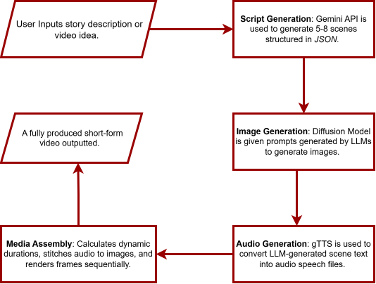

# AI Video Generator

A multi-modal AI pipeline that transforms a text prompt into a short-form video. Uses LLM for scriptwriting, Diffusion Models for image generation and TTS for narration.


---

<div align="center">




</div>


## Dependencies

* [Google Gemini API key](https://ai.google.dev/)
* [Cloudflare API token](https://dash.cloudflare.com/)
* Required Python packages:

  ```bash
  pip install google-generativeai requests gtts moviepy pillow
  ```

---

## Usage

1. Add your API keys to the environment

2. Run the script:

```bash
python app.py
```
